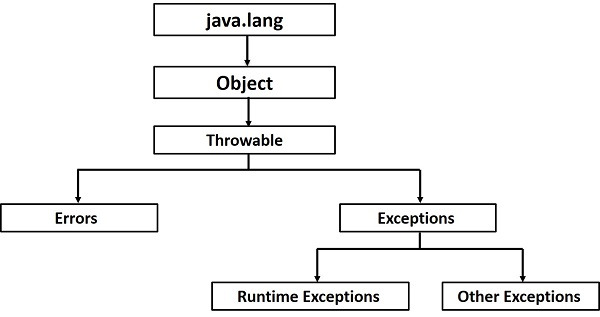

# Java 예외 처리(Exception)

> 프로그램 실행 중(Runtime)에 발생하는 비정상적인 상황을 의미

### 대표 예외 상황

- 존재하지 않는 파일 읽기
- 0으로 나누기
- DB 연결 실패
- 잘못된 사용자 입력

### Java 예외 계층 구조

- Java의 모든 예외는 최상위 클래스인 Throwable을 상속받음




### 예외의 종류와 특징

##### Error

- Java.lang.Error 클래스의 서브클래스들

- 주로 Java VM에서 발생시키는 것이고 애플리케이션 코드에서 잡으려고 하면 안됨

- 예시로는 OutOfMemoryError, ThreadDeath, StackOverflowError가 있다

- 위 같은 에러는 try - catch 블록으로 안잡힘 → 에러를 잡기 위해서 시스템 내에서 특별한 작업을 수행해야 함

##### Exception

- Java.lang.Exception 클래스의 서브클래스들

- Error와 달리 개발자들이 만든 애플리케이션 코드의 작업 중에 예외 상황이 발생했을 경우 사용

- Exception은 CheckedException과 UnCheckedException으로 구분된다.

###### CheckedException

- RuntimeException을 상속하지 않은 클래스들이다

- 컴파일 시점에 반드시 처리해야 하는 예외

- 예시로는 IOException, SQLException, ClassNotFoundException 가 있다

- 반드시 try - catch로 예외처리를 진행해줘야 함(아니면, throws를 정의해서 메소드 밖으로 넘기던가 해야 함)

###### UnCheckedException

- RuntimeException을 상속한 클래스들이다(런타임 예외라고도 불림)

- 컴파일러가 강제하지 않는 예외

- 예시로는 NullPointerException,IllegalArgumentException,ArithmeticException,IndexOutOfBoundsException가 있다

- 프로그램에 오류가 있을 때 발생하도록 의도된 것

### 예외처리 방법

##### 1. 예외 복구

- 예외가 발생했지만 프로그램이 정상 상태로 돌아가도록 처리하는 방법

> "문제가 발생했지만 해결해서 계속 진행한다."

- 예시 : 서버 통신 중 일시적으로 실패

```java
public String callApi() {
    int retry = 3;

    while (retry-- > 0) {
        try {
            return apiClient.request();
        } catch (IOException e) {
            System.out.println("재시도...");
        }
    }

    throw new RuntimeException("통신 실패");
}
```

- 사용자는 실패 사실을 모름

##### 2. 예외처리회피

- 현재 계층에서 처리하지 않고 예외를 자신을 호출한 쪽으로 넘기는 방법

> "나는 처리할 수 없으니 더 잘 처리할 수 있는 곳으로 넘긴다."

- 예시 : DAO , Service, Controller DBConnection 전략

```java
public User findById(Long id) throws SQLException {
    ...
}

```
```java
public User getUser(Long id) throws SQLException {
    return userDao.findById(id);
}
```

```java
try {
    userService.getUser(id);
} catch (SQLException e) {
    log.error("DB 오류");
}
```

- DAO는 DB 오류를 처리할 수 없으므로, Service에게 넘김, Service도 Controller에게 넘긴 후, Controller에서 예외 처리
