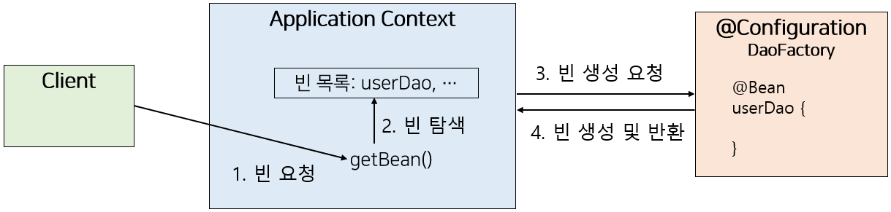

# Application-context

- Aplication-context = Ioc Container = Bean factory

- 객체(Bean)를 생성하고 , 연결하고, 관리해주는 공장 + 관리자 역할

- Spring framework의 핵심 Container

### Application-context의 핵심 역항

- Bean 생성 : 객체 생성

- DI 수행 : 의존성 주입

- Singleton 관리 : 객체 재사용

- 생명주기 관리 : 초기화 소멸

- AOP 지원 : 프록시 생성

### Aplication-context 동작 방식

- Spring 실행 → Application-context 생성 → 설정 정보 읽기 → Bean 객체 생성 → 의존성 주입(DI) → Bean 저장

### Applicaton-context 장점

- 클라이언트는 구체적인 팩토리 클래스를 알 필요가 없다

- 애플리케이션 컨텍스트는 종합 IoC서비스를 제공한다

- 애플리케이션 컨텍스는 빈을 검색하는 다양한 방법을 제공한다

