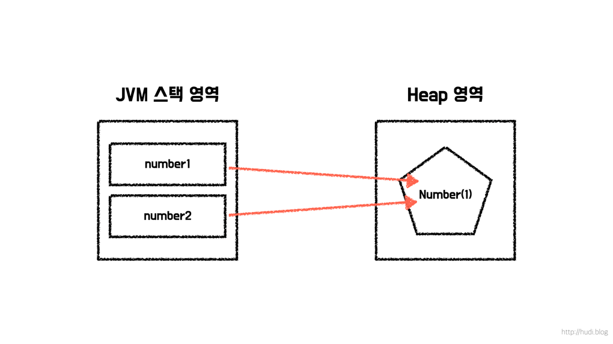
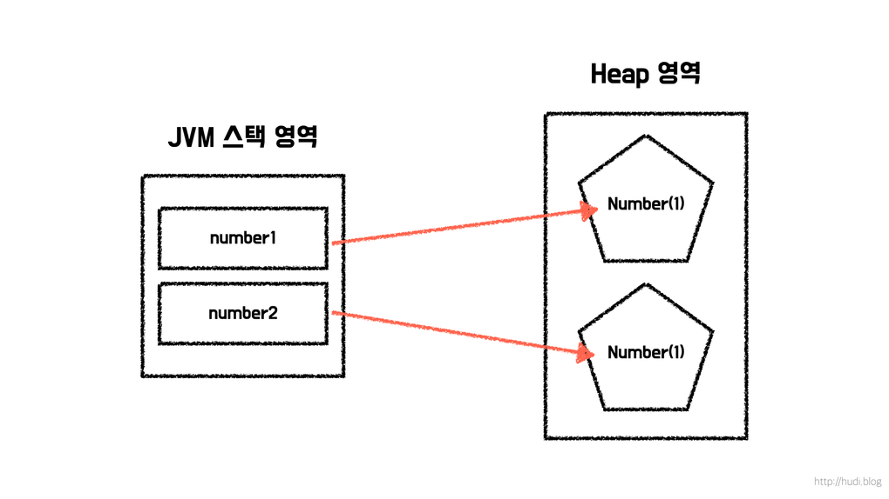

# 오브젝트의 동일성과 동등성

### 동일성(Identtity)

> "두 객체가 메모리 상에서 같은 객체인가?"

- 주소값이 같은지 비교하는 것 ('==' 연산자 사용)

```java
String str1 = new String("hello");
String str2 = str1;

System.out.println(str1 == str2);   // true
```

```text
str1 ──┐
        ├── [ "hello" ]
str2 ──┘
```

### 동등성(Equality)

> "두 객체의 내용(값)이 같은가?"

- 두 객체가 논리적인 값이 같은지 비교하는 것.
- Java에서는 보통 equals()를 사용. 
(equals() 함수를 따로 @Override 하지 않았다면, 최상위 클래스인 Object 클래스에 구현되어 있는 equals() 메소드가 사용된다)

```java
String str1 = new String("hello");
String str2 = new String("hello");

System.out.println(str1.equals(str2));  // true

```
- 서로 다른 객체이지만 논리적인 값은 같기 때문에 '동등'하다.

```text
str1 ───► [ "hello" ]

str2 ───► [ "hello" ]
```

### 동등성 vs 동일성

- 동등성 : 논리(실제 보여지는) 값 비교
- 동일성 : 주소 값 비교

```java
String str1 = new String("hello");
String str2 = new String("hello");

System.out.println(str1 == str2);         // false
System.out.println(str1.equals(str2));    // true
```