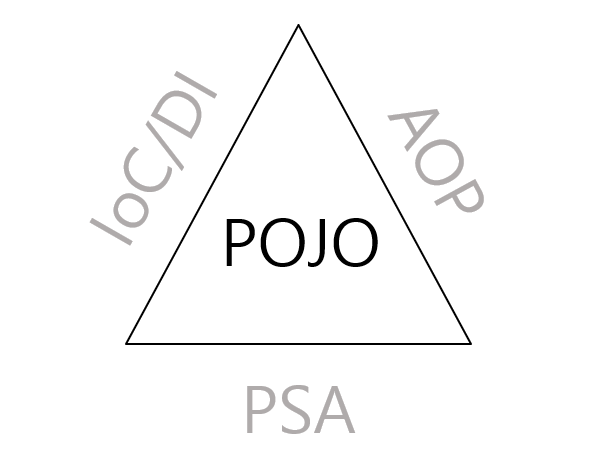

# 객체지향프로그래밍

## POJO(Plain Old Java Object)



### 정의

- 오래된 방식의 간단한 자바 오브젝트라는 말로써 Java EE등의 중량 프레임워크들을 사용하게 되면서 해당 프레임워크에 종속된 '무거운' 객체를 만들게 된 것에 반발해서 사용되게 된 용어

- 대표적으로 스프링 프레임워크가 POJO 프로그램을 따르는 프레임워크이다

- 스프링은 JPA와 같은 표준 기술을 쉽게 사용할 수 있도록 지원하며, JPA 구현체인 Hibernate를 통해 객체를 POJO 형태로 유지하면서 데이터베이스와 매핑할 수 있다.

### POJO Programming

- 1. Java나 Java의 스펙에 정의된 것 이외에는 다른 기술이나 규약에 얽매이지 않아야 한다.(상속 X)

```java
public class User {
    private String userName;
        public String getUserName() {
        return userName;
    }

    public void setUserName(String          userName) {
        this.userName = userName;
    }
}
```

- 2. 특정 환경에 종속적인 어노테이션이나 설정을 최소화해야 한다

- 3. 객체는 상태(State)와 행위(Behavior)를 스스로 가져야 한다

- 4. 비즈니스 로직은 인터페이스 기반으로 느슨하게 연결되어야 한다.

- 5. 객체는 별도의 WAS없이 테스트가 가능해야 한다.

---

## IoC / DI

### IoC(Inversion of Control) : 제어의 역전

- 정의 : 객체의 생성과 제어 권한을 개발자가 아니라 Spring과 같은 프레임워크가 관리하는 것

- 기존에는 개발자가 직접 객체를 생성 했지만 IoC가 등장하고서 Spring 컨테이너가 객체를 생성/관리

- [Spring_IoC](Spring_IoC.md)

### DI(Dependency Injection) : 의존성 주입

- 정의 : 객체가 필요한 의존성을 직접 생성하지 않고 외부에서 주입받는 것

- Spring Framework의 3가지 핵심 프로그래밍 중 하나로 외부에서 두 객체간의 관계를 결정해주는 디자인 패턴

- 인터페이스를 사이에 둬서 클래스 레벨에서는 의존관계가 고정되지 않도록 하고 런타임시 관계를 동적으로 주입하여 유연성을 확보하고 결합도를 낮출수 있게 해준다.

- [Spring_DI](Spring_DI.md)

---
