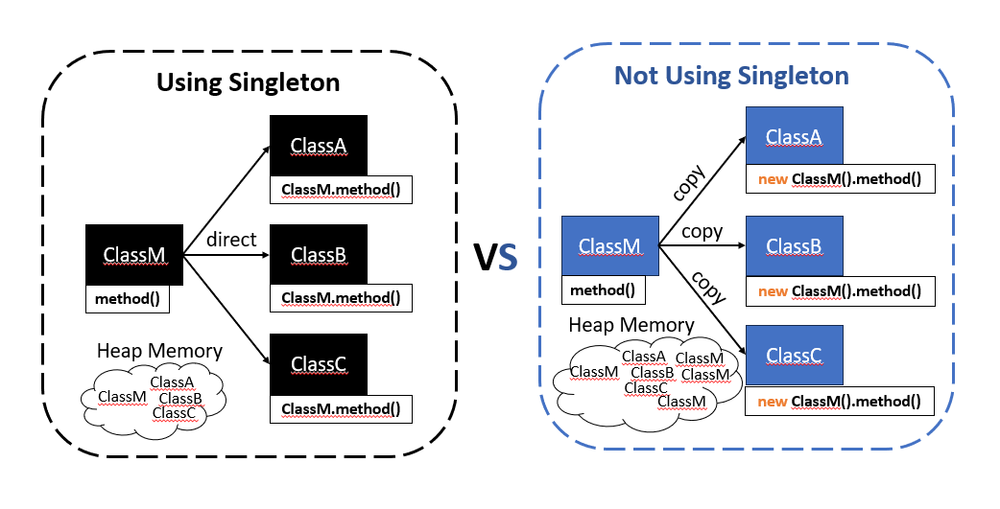
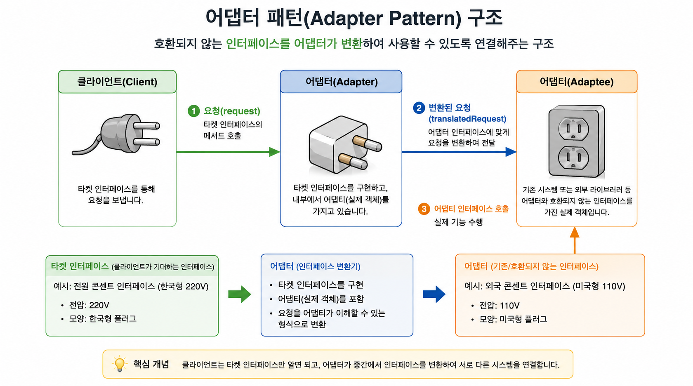
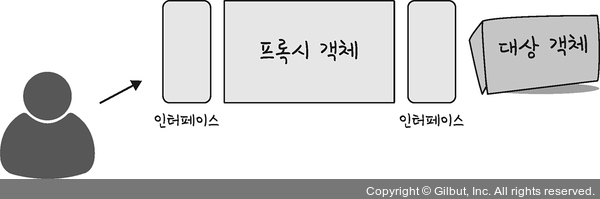

# 전략패턴 

### 전략패턴(Strategy Pattern)이란 

> 동일한 기능을 수행하지만 구현 방식이 여러 개인 경우, 실행 시정에 적절한 알고리즘(전략)을 선택할 수 있도록 하는 디자인 패턴

--- 

### 싱글톤 패턴



- GoF가 소개한 디자인 패턴 중 하나다

- 어떤 클래스를 애플리케이션 내에서 제한된 인스턴스 개수, 이름처럼 하나만 존재하도록 강제하는 패턴

- 인스턴스를 하나만 만들어 재사용함으로써 불필요한 자원 낭비 방지

- 싱글톤 패턴 구현 방법
  
  - 클래스 밖에서는 오브젝트를 생성하지 못하도록 생성자를 private로 만든다
  
  - 생성된 싱글톤 오브젝트를 저장할 수 있는 자신과 같은 타입의 스태틱(Static) 필드를 정의한다

  - 스태틱 팩토리 메소드인 getInstance()를 만들고 이 메소드가 최초로 호출되는 시점에서 한번만 오브젝트가 만들어지게 한다. 생성된 오브젝트는 스태틱 필드에 저장된다. 또는 스태틱 필드의 초기값으로 오브젝트를 미리 만들어둘수 있다.
  
  - 한번, 오브젝트(싱글톤)가 만들어지고 난 후에는 getInstance() 메소드를 통해 이미 만들어져 스태틱 필드에 저장해둔 오브젝트를 넘겨준다.

  - 예시)
  
  ``` java
  public class UserDao(){
    private static UserDao INSTANCE;                        // 정적 참조 변수

    private UserDao(ConnectionMaker connectionMaker){       // private 생성자
      this.connectionMaker = connectionMaker;
    }

    public static synchronized UserDao getInstance(){       // 객체 반환 정적 메서드
      if(INSTANCE == null) INSTANCW = new UserDao(???);
      return INSTANCE;
    }
  }

  ```

- 싱글톤 패턴 구현 방식 특징
  
  - private 생성자를 갖고 있기 때문에 상속 불가
  
  - 싱글톤은 테스트하기 힘들다(거의 불가능)
  
  - 서버환경에서는 싱글톤이 하나만 만들어지는 것을 보장하지 못한다
  
  - 싱글톤의 사용은 전역 상태를 만들 수 있기 때문에 바람직하지 못하다

- 싱글톤 패턴을 사용하는 이유는 아래와 같다

##### Spring이 싱글톤이 Default인 이유

- 요청마다 클라이언트로 부터 요청을 받아 객체를 생성해야 한다면 수백개의 Bean이 동시에 생성됨 → 메모리 낭비 , 성능 저하, GC 낭비

```text
ex) 사용자 1000명 접속

사용자 1000명 접속

Controller 1000개

Service 1000개

Repository 1000개

```
- 이러한 문제를 해결하기 위해 엔터프라이즈 환경에서 Servlet(서블릿) 도입, 서블릿은 멀티스레드 환경에서 싱글톤으로 동작하며, 하나의 오브젝트만 마ㄴ들어두고 스레드에서 하나의 오브젝트를 공유하는 방식으로 사용

##### 싱글톤 레지스트리
- Spring Container는 기본적으로 Bean을 아래처럼 관리 
```java
@Scope("singleton")
```

- 즉, 아래 Component는 애플리케이션 전체에서 UserSerivice 한 개만 생성
```java
@Component
public class UserService {
}
```
- Application-context에 보관하게 되는데 이것을 싱글톤 레지스트리(Singleton Registry) 라고 함.

##### 싱글톤 Bean의 동일성과 동등성

- [Object_동일성_동등성](Object_동일성_동등성.md)
- 동일성은 같은 객체를 참조하기 때문에 항상 같다
- 동등성은 동일한 객체이므로 항상 같다

```java
UserService user1 =
    context.getBean(UserService.class);

UserService user2 =
    context.getBean(UserService.class);

System.out.println(user1 == user2);   // true    
user1.equals(user2)                   // true
```
--- 

### 어탭터 패턴(Adapter Pattern)



- 객체를 속성으로 만들어서 참조하는 디자인 패턴으로써, 서로 호환되지 않는 인터페이스를 연결해주는 패턴

- 기존 코드의 인터페이스와 새로운 코드의 인터페이스가 다를 때 중간에서 변환해주는 역할을 해줌

- 호출당하는 쪽의 메서드를 호출하는 쪽의 코드에 대응하도록 중간에 변환기를 통해 호출하는 패턴

```java
class AdapterServiceA{
  ServiceA sa1 = new ServiceA();

  void runService(){
    sa1.runServiceA();
  }
}

class AdapterServiceB{
  ServiceB sb1 = new ServiceB();

  void runService(){
    sb1.runServiceB();
  }
}

public class ClientWithAdapter{
  public static void main(String[] args){
    AdapterServiceA asa1 = new AdapterServiceA();
    AdapterServiceB = asb1 = new AdapterServiceB();

    asa1.runService();
    asb1.runService();
  }
}
```
##### 대표적인 Adapter Pattern

- DispatcherServlet : handler.handle()을 호출해야 함. 하지만 @Controller ,@RestController 각각의 호출방식이 틀림. 그래서 Spring은 HandlerAdapter를 사용해서 Controller 타입에 관계없이 호출 가능

- JdbcTemplate : DB 벤더마다 API가 다를 수 있지만, jdbcTemplate.query()를 통해 동일하게 사용할 수 있음(내부에서 JDBC Driver를 어댑팅해서 사용)

--- 

### 프록시 패턴(Proxy Pattern)



- 실제 객체에 직접 접근하지 않고, 대신 Proxy(대리인)를 통해 접근하도록 하는 패턴

- 실제 객체 앞에 대리인을 두고 접근을 제어 

- 제어 흐름을 조정하기 위한 목적으로 중간에 대리자를 두는 패턴

- Proxy는 실제 서비스와 같은 이름의 메서드를 구현한다.(인터페이스 사용)

- Proxy는 실제 서비스에 대한 참조 변수를 갖는다

- Proxy는 실제 서비스의 같은 이름을 가진 메서드를 호출하고 그 값을 클라이언트에게 돌려준다

- Proxy는 실제 서비스의 메서드 호출 전후에 별도의 로직을 수행할 수도 있다

```java

class interface IService{
  String runSomething();
}

class Service implements IService{
  public String runSomething(){
    return "서비스 짱!!!";
  }
}

class Proxy implements IService{
  IService service1;                          

  public String runSomething(){
    System.out.println("호출에 대한 흐름 제어가 주목적, 반환 결과를 그대로 전달");
    service1 = new Service();
    return service1.runSomething();
  }
}

public class ClientWithProxy{
  public static void main(String[] args){
    IService proxy = new Proxy();
    System.out.println(proxy.runSomething());
  }
}

```

##### 대표적인 Proxy 패턴

- @Transactional : Spring에서 자동생성한 Proxy가 Client → Transaction Proxy → Service 순으로 작업을 수행

- AOP : 내부적으로 Proxy를 생성하여 Client → Logging Proxy → Service 순으로 작업을 수행

- @Cacheable : Proxy가 캐시 조회 → 없으면 DB 조회 → 캐시 저장을 수행

---

### 데코레이터 패턴(Decorator pattern)

- 기존 객체를 수정하지 않고 객체에 새로운 기능을 동적으로 추가하는 패턴(상속없이 기존기능 + 추가 기능)

- 프록시 패턴과 구현 방식이 동일하지만, 클라이언트가 받는 반환값에 장식(Decorate)을 덧입한다.

- 장식자는 실제 서비스와 같은 실제 서비스와 같은 이름의 메서드를 구현한다(인터페이스 사용)

- 장식자는 실제 서비스에 대한 참조 변수를 갖는다

- 장식자는 실제 서비스와 같은 이름을 가진 메서드를 호출하고, 그 반환값에 장식을 더해 클라이언트에게 돌려준다

- 장식자는 실제 서비스의 메서드 호출 전후의 별도의 로직을 수행할 수도 있다

- 메서드 호출의 반환값에 변화를 주기 위해 중간에 장식자를 두는 패턴

##### 대표적인 Decorator 패턴

- Java I/O : InputStream → FileInputStream → BufferedInputStream → DataInputStream
